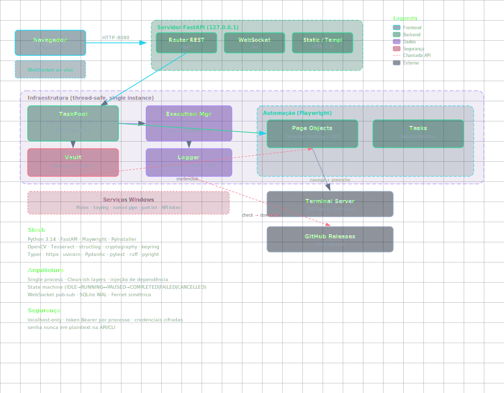
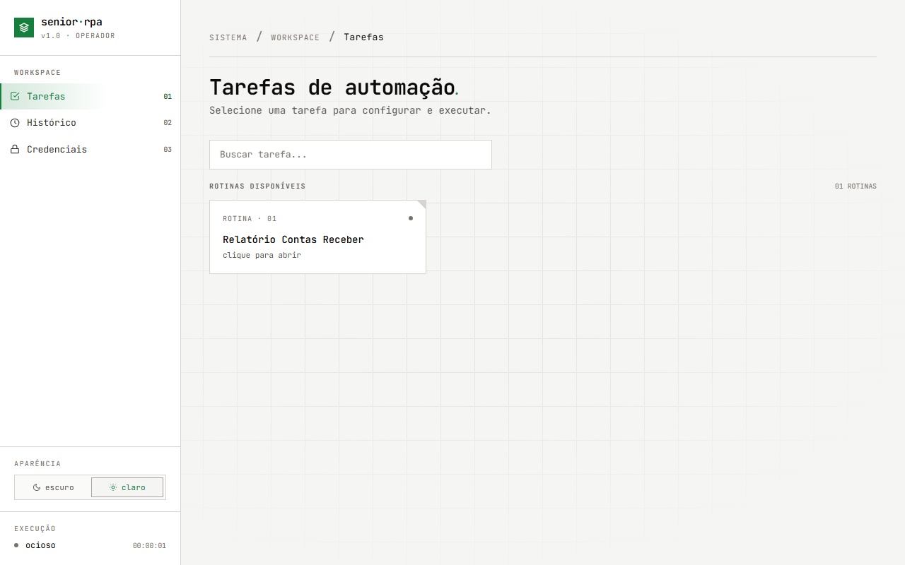

# TerminalServerRPA

[](https://github.com/SrMarinho/TerminalServerRPA/actions/workflows/ci.yml)
[](https://www.python.org/)
[](https://fastapi.tiangolo.com/)
[](https://playwright.dev/)
[](https://github.com/astral-sh/ruff)
[](https://github.com/microsoft/pyright)
[](https://pyinstaller.org/)
[](LICENSE)

**Automação RPA para ERPs legados rodando dentro de Terminal Server.**

Muitas empresas brasileiras executam ERP Senior, Protheus, SAP ou sistemas
próprios dentro de sessões de Terminal Server — sem API, sem DOM acessível,
sem integração moderna. Este projeto automatiza esses fluxos usando:

- **Playwright** + **OCR** (Tesseract) + **template matching** (OpenCV)
  para navegar por interfaces legadas renderizadas como bitmap
- **FastAPI** local com **WebSocket** para execução e log ao vivo
- **Cofre criptografado** (Windows Keyring + criptografia simétrica Fernet)
- **Auto-atualização** via GitHub Releases com hot-swap

> [!NOTE]
> Aplicação Windows nativa. O servidor escuta apenas em `127.0.0.1` —
> nunca exposto à rede.

## Funcionalidades

- **Cofre de senhas** — credenciais criptografadas no Gerenciador de Credenciais do Windows
- **Interface web** — Tailwind SPA servida pelo FastAPI (localhost)
- **WebSocket ao vivo** — logs, screenshots, status da execução em tempo real
- **Executor de tarefas** — máquina de estados com pausar/retomar/cancelar/pular
- **CLI** — gerenciar cofre, executar tarefas, ver logs
- **Instância única** — mutex do Windows + foco na janela existente
- **Auto-atualização** — verifica GitHub Releases e aplica em segundo plano via `POST /api/update`
- **Fallback de porta** — encontra próxima porta livre se 8080 estiver ocupada

## Início rápido

```bash
# Instalar dependências
uv sync

# Rodar a interface web
uv run python main.py web

# Gerenciar credenciais (CLI)
uv run python main.py vault set meu-servico -u meu-usuario
uv run python main.py vault list

# Executar uma tarefa RPA
uv run python main.py run "Relatório Contas Receber"
```

## Desenvolvimento

```bash
# Testes (145, pytest + coverage)
uv run pytest

# Lint
uv run ruff check

# Checagem de tipos
uv run pyright src

# Formatação
uv run ruff format

# Gerar executável
uv run pyinstaller main.spec
```

## Arquitetura


*Diagrama interativo completo: [TerminalServerRPA/docs/architecture-diagram.html](https://srmarinho.github.io/TerminalServerRPA/architecture-diagram.html)*



Camadas dentro de um único processo Windows:

```
main.py                      Entrypoint Typer
src/
  interfaces/web/            FastAPI, WebSocket, UI estática
  interfaces/cli/            CLI Typer
  infrastructure/            Vault, TaskRunner, SQLite, Logger, Updater
  automation/pages/          Page Objects (Playwright + OCR)
  automation/tasks/          GeracaoRelatorio (espelha menu do Senior ERP)
  config/                    Configuração + versão
  utils/                     image_match, window_utils
```

Diagrama completo interativo: [TerminalServerRPA/docs/architecture-diagram.html](https://srmarinho.github.io/TerminalServerRPA/architecture-diagram.html)

## Segurança

- Servidor vinculado a `127.0.0.1` — sem exposição à rede
- Token Bearer (automático) em todas as rotas REST + WebSocket
- Credenciais cifradas via Fernet + Windows Keyring — **nunca em plaintext na API ou CLI**
- Pipeline CI executa lint + typecheck + testes a cada push

## Stack

| Categoria | Tecnologias |
|-----------|-------------|
| **Runtime** | Python 3.14, uv (package manager) |
| **Web** | FastAPI, Uvicorn, WebSocket, Tailwind CSS |
| **RPA** | Playwright, OpenCV (template matching), Tesseract (OCR) |
| **Infra** | structlog (logs), cryptography (Fernet), keyring (Windows), SQLite |
| **Build** | PyInstaller, GitHub Actions (CI + Release) |
| **Qualidade** | pytest, ruff, pyright |

## Documentação

| Público | Links |
|---------|-------|
| Usuários | [Instalação](docs/installation.md) · [Guia do usuário](docs/user-guide.md) · [CLI](docs/cli-reference.md) |
| Devs | [Arquitetura](docs/architecture.md) · [Desenvolvimento](docs/development.md) · [API](docs/api-reference.md) · [Segurança](docs/security.md) |
| Decisões | [ADRs](docs/decisions/) · [Roadmap](docs/roadmap.md) · [CHANGELOG](CHANGELOG.md) |

## Licença

MIT. Veja [LICENSE](LICENSE).
